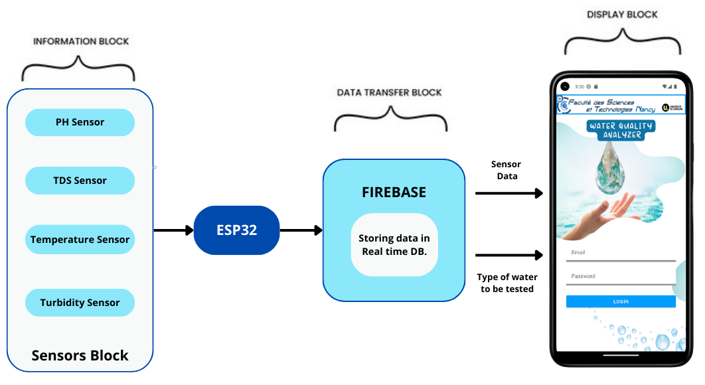

IoT-Based Water Quality Monitoring System
This project is an Internet of Things (IoT) solution designed to monitor water quality parameters in real time. The system uses a combination of sensors, a microcontroller, and a mobile application to measure and display essential water quality metrics.

Features
Real-time monitoring of water quality.
Measurement of key parameters:
pH: Determines the acidity or alkalinity of water.
Temperature: Monitors the water's temperature.
TDS (Total Dissolved Solids): Measures dissolved substances in the water.
Turbidity: Assesses the water's clarity.
Data visualization via a mobile application.
Technologies Used
ESP32 Microcontroller: Manages sensor data collection and communication with Firebase.
Firebase Realtime Database: Stores water quality data for remote access.
Android Studio: Used to develop the mobile application for data visualization.
Sensors:
pH Sensor
Turbidity Sensor
TDS Sensor
Temperature Sensor (DS18B20)
How It Works
Sensors measure water quality parameters.
The ESP32 microcontroller collects data from the sensors.
Data is sent to Firebase for storage and access.
The mobile app fetches data from Firebase and displays it in an easy-to-understand format.
Mobile Application
The Android application provides a user-friendly interface to monitor water quality parameters remotely, ensuring accessibility and convenience.

Demo
Check out the video demonstration(https://drive.google.com/file/d/17rYgAkNsUIyD6-WSyTBsx_XJkcv8v4mb/view?usp=sharing) of the project to see it in action!
